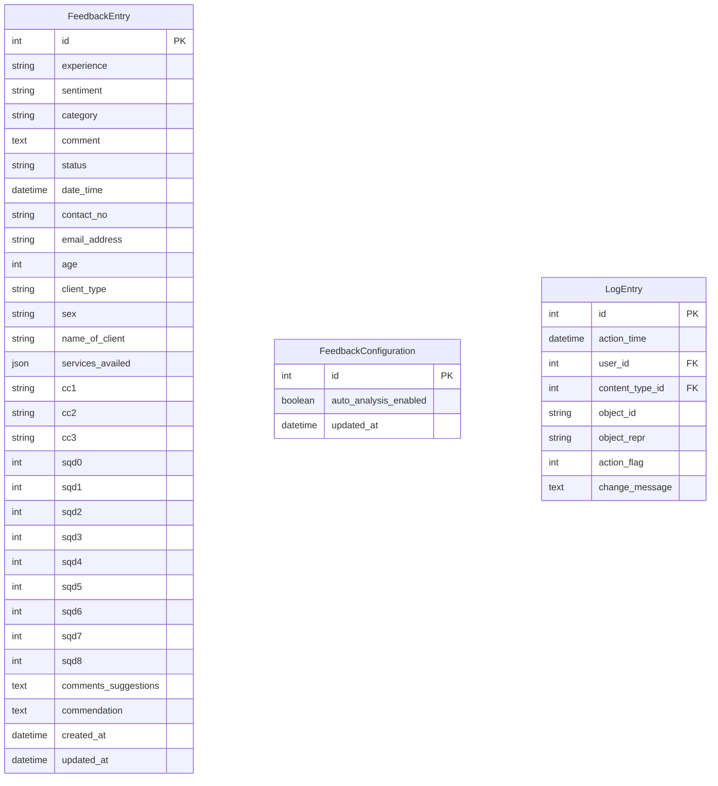
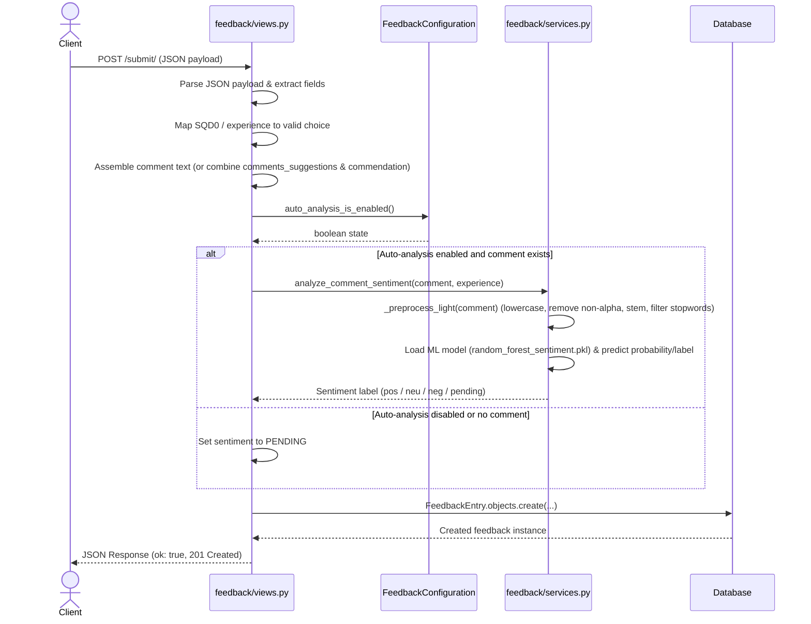

# Project Documentation

## 1. Project Overview

The PhilHealth Feedback System is a comprehensive web application built using Django (`philhealth_feedback`) designed for collecting, processing, analyzing, and managing Client Satisfaction Measurement (CSM) feedback for PhilHealth (specifically referenced as LHIO Cauayan City). 

The repository is modularly structured into two primary Django applications:
1. **`feedback`**: Manages the public-facing client feedback submission interface, the data model for feedback records and singleton system configurations, and an automated sentiment analysis service leveraging a machine learning pipeline (Random Forest model and NLTK text preprocessing).
2. **`feedback_admin`**: Implements an authenticated administrative portal complete with custom dashboards, multi-period statistical reports (daily, weekly, monthly, quarterly, annual), response management (status updates, category assignments, and action notes), an audit trail logging system integrated with Django's built-in `LogEntry` table, user and group management, password management, sentiment analysis configuration toggles, and secure manual database backup and restore utilities using MySQL client tools.

---

## 2. Technology Stack

Based on the repository configuration (`philhealth_feedback/settings.py`) and source code, the technology stack consists of:
- **Framework:** Django (Python)
- **Database Engine:** PostgreSQL (default via settings using `django.db.backends.postgresql`), with MySQL support explicitly implemented for backup and restore subprocess utilities (`mysqldump` and `mysql` client CLI).
- **Frontend & Styling:** HTML templates utilizing Tailwind CSS (loaded via CDN), Google Fonts (IBM Plex Sans, IBM Plex Mono), and Material Icons Round.
- **Machine Learning & NLP:** `joblib` (for loading pre-trained `random_forest_sentiment.pkl` models), NLTK (`SnowballStemmer`, custom stop words from `stopwords_en.txt`).
- **Deployment & Static Files:** WhiteNoise (`whitenoise.middleware.WhiteNoiseMiddleware`) for serving static files, `python-dotenv` for loading environment variables from `.env`.

---

## 3. Project Structure

```text
philhealth_feedback/
├── manage.py                       # Django project management utility script
├── philhealth_feedback/            # Root Django project configuration directory
│   ├── __init__.py
│   ├── asgi.py                     # ASGI deployment configuration
│   ├── settings.py                 # Project configuration (database, apps, middleware, time zones)
│   ├── urls.py                     # Root URL dispatcher including admin and app routes
│   └── wsgi.py                     # WSGI deployment configuration
├── feedback/                       # Public feedback application
│   ├── admin.py                    # Django admin model registration (empty)
│   ├── apps.py                     # FeedbackConfig AppConfig
│   ├── models.py                   # FeedbackEntry and FeedbackConfiguration models
│   ├── services.py                 # Sentiment analysis, text preprocessing, and batch re-analysis
│   ├── tests.py                    # Automated test cases for public submission and sentiment services
│   ├── urls.py                     # Public URL routing ('', 'submit/')
│   └── views.py                    # Public index view and JSON feedback submission endpoint
├── feedback_admin/                 # Administrative portal application
│   ├── admin.py                    # Django admin model registration (empty)
│   ├── apps.py                     # FeedbackAdminConfig AppConfig
│   ├── backup_utils.py             # Secure MySQL backup and restore helper utilities
│   ├── context_processors.py       # Global feedback stats context processor
│   ├── models.py                   # Model definitions (empty)
│   ├── tests.py                    # Automated test cases for admin views, reports, and settings
│   └── urls.py                     # Admin URL routing (auth, dashboard, responses, reports, users, backups)
├── templates/                      # Global HTML templates directory
│   └── base.html                   # Base layout template with Tailwind CDN and font preconnects
└── static/                         # Static assets directory
```

---

## 4. Application Components

### Root Project (`philhealth_feedback`)
- **`settings.py`:** Configures installed apps (`feedback`, `feedback_admin`), middleware (including WhiteNoise for static files), database connections, internationalization (`Asia/Manila` timezone), static files storage, login/logout redirect URLs, and backup storage directories.
- **`urls.py`:** Routes requests between Django's built-in admin (`/admin/`), the public feedback app (`/`), and the administrative dashboard (`/dashboard/`).

### Public Feedback Application (`feedback`)
- **Models (`feedback/models.py`):**
  - `FeedbackEntry`: Stores feedback submissions including experience ratings (Service Quality Dimensions - SQD), detected or manual sentiment, category, comment, status, date/time, contact number, email address, age, client type, sex, client name, services availed (stored as JSON), Citizen's Charter compliance fields (`cc1`, `cc2`, `cc3`), SQD ratings (`sqd0` through `sqd8`), detailed comments/suggestions, commendations, and timestamps (`created_at`, `updated_at`). Indexed on `status` and `created_at`.
  - `FeedbackConfiguration`: Singleton model (`pk=1`) storing the global `auto_analysis_enabled` boolean flag.
- **Services (`feedback/services.py`):** Handles machine learning model loading (`_get_model`), light text cleaning and stemming (`_preprocess_light`), fallback sentiment determination from experience ratings (`_fallback_from_experience`), sentiment analysis inference (`analyze_comment_sentiment`), and batch re-analysis of pending entries (`reanalyze_pending_entries`).
- **Views (`feedback/views.py`):** Renders the public index template and implements `submit_feedback`, which parses incoming JSON payloads, maps SQD and experience ratings, synthesizes comments, checks auto-analysis settings, parses datetimes/integers safely, and creates `FeedbackEntry` records.

### Administrative Application (`feedback_admin`)
- **Views (`feedback_admin/views.py`):** Manages admin authentication (`admin_login`, `admin_logout`), dashboard analytics and trends, response reviews and pagination data, response status updates, response category updates, note/reply additions, sentiment analysis metrics and trends, multi-period statistical reports (daily, weekly, monthly, quarterly, annual with hourly/daily/weekly/monthly trend bucketing), audit log viewing (`activity_log`), user and group management CRUD views, password changes (`change_password`), sentiment settings updates, batch re-analysis triggers, and database backup/restore operations.
- **Backup Utilities (`feedback_admin/backup_utils.py`):** Provides functions (`create_backup`, `list_backups`, `resolve_backup_path`, `delete_backup`, `restore_backup`) to execute full MySQL database dumps and restores via `mysqldump` and `mysql` CLI subprocesses while securing credentials using temporary `0600`-permission configuration files.
- **Context Processors (`feedback_admin/context_processors.py`):** Injects `global_feedback_count` into template context for all requests starting with `/dashboard/`.

---

## 5. Data Model

The database schema is defined primarily in the `feedback` app (`FeedbackEntry` and `FeedbackConfiguration`) and integrates with Django's built-in authentication models (`User`, `Group`, `Permission`) and admin audit log (`LogEntry`).



### Entity Details
- **`FeedbackEntry`:**
  - **Experience Choices:** `strongly_agree`, `agree`, `neither`, `disagree`, `strongly_disagree`, `na` (Not Applicable).
  - **Sentiment Choices:** `pos` (Positive), `neu` (Neutral), `neg` (Negative), `pending`.
  - **Status Choices:** `pending`, `reviewed`, `resolved`.
  - **Category Choices:** `complaint`, `suggestion`, `compliment`, `concern`.
  - **Database Constraints & Indexes:** Ordered by `-created_at` descending. Indexed on `status` and `created_at`.
- **`FeedbackConfiguration`:**
  - Singleton configuration model enforcing `pk=1` via custom `save()` and `@classmethod` helpers (`get_solo()`, `auto_analysis_is_enabled()`).

---

## 6. API / Routes

### Public Routes (`feedback/urls.py`)
- `GET /` (`feedback-index`): Renders the public feedback submission form (`feedback/index.html`).
- `POST /submit/` (`feedback-submit`): Accepts a JSON payload containing client feedback, evaluates experience ratings and comment data, performs conditional sentiment analysis, and persists a `FeedbackEntry` (returns `201 Created` with JSON status).

### Administrative Routes (`feedback_admin/urls.py`)
- **Authentication:**
  - `GET/POST /dashboard/login/` (`admin_login`): Staff login page.
  - `POST /dashboard/logout/` (`admin_logout`): Terminates staff session.
- **Dashboard & Analytics Pages:**
  - `GET /dashboard/` (`dashboard`): Main admin overview, summary cards, and trend graphs.
  - `GET /dashboard/responses/` (`responses`): Detailed response management table and activity history.
  - `GET /dashboard/sentiment_analysis/` (`sentiment_analysis`): Sentiment distribution and trend charts.
  - `GET /dashboard/reports/` (`reports`): Multi-period statistical reports (daily, weekly, monthly, quarterly, annual) with structured report JSON for frontend charts.
  - `GET /dashboard/activity-log/` (`activity_log`): Government-facing audit trail sourced from `django_admin_log`.
  - `GET /dashboard/settings/` (`settings_page`): System settings, sentiment controls, and backup/restore management.
- **Response Management Actions:**
  - `POST /dashboard/responses/<int:entry_id>/status/` (`response_status_update`): Updates feedback status (`pending`, `reviewed`, `resolved`) and logs the change.
  - `POST /dashboard/responses/<int:entry_id>/category/` (`response_category_update`): Updates feedback category (`complaint`, `suggestion`, `compliment`, `concern`) and logs the change.
  - `POST /dashboard/responses/<int:entry_id>/notes/add/` (`response_note_add`): Adds a staff reply or action note to a feedback entry as an addition log.
- **User & Group Management:**
  - `GET /dashboard/users/` (`users`): User management overview listing users, groups, and permissions.
  - `POST /dashboard/users/add/` (`user_add`): Creates a new user account with specified roles and permissions.
  - `POST /dashboard/users/<int:user_id>/edit/` (`user_edit`): Updates user details, passwords, active status, and permissions.
  - `POST /dashboard/users/<int:user_id>/delete/` (`user_delete`): Deletes a user account.
  - `POST /dashboard/users/<int:user_id>/toggle/` (`user_toggle_active`): Toggles user active/inactive status.
  - `POST /dashboard/groups/add/` (`group_add`): Creates a new permission group.
  - `POST /dashboard/groups/<int:group_id>/edit/` (`group_edit`): Updates group name and permissions.
  - `POST /dashboard/groups/<int:group_id>/delete/` (`group_delete`): Deletes a permission group.
  - `POST /dashboard/settings/password/` (`change_password`): Updates the logged-in admin's password.
- **Settings & Backups (Superuser Restricted):**
  - `POST /dashboard/settings/sentiment/` (`update_sentiment_settings`): Toggles global auto-analysis configuration.
  - `POST /dashboard/settings/reanalyze/` (`reanalyze_sentiment`): Triggers batch re-analysis of pending feedback comments.
  - `POST /dashboard/settings/backup/create/` (`backup_create`): Creates a manual timestamped `.sql` backup.
  - `POST /dashboard/settings/backup/restore/` (`backup_restore`): Restores the database from an uploaded SQL dump (with an automatic safety backup).
  - `GET /dashboard/settings/backup/<str:filename>/download/` (`backup_download`): Downloads a specific backup SQL file.
  - `POST /dashboard/settings/backup/<str:filename>/delete/` (`backup_delete`): Deletes a backup SQL file.

---

## 7. Application Workflow

The following sequence diagram illustrates the end-to-end execution flow when a client submits feedback through the public submission endpoint:



---

## 8. Business Logic

- **Experience Mapping (`SQD_MAP`):** Incoming submissions may provide satisfaction ratings via `sqd0` (integer or string 1–6) or direct `experience` strings. These are mapped against an extensive dictionary supporting standard choices (`strongly_disagree`, `disagree`, `neither`, `agree`, `strongly_agree`, `na`) as well as legacy fallbacks (`vsat`, `sat`, `unsat`).
- **Comment Synthesis & Validation:** If a direct `comment` field is absent, the system constructs a formatted comment string by joining `comments_suggestions` and `commendation` with header prefixes (`Comments: ... | Commendation: ...`). Comments are validated to ensure they do not exceed 1,000 characters.
- **Sentiment Analysis & Fallback Pipeline:**
  1. If comment text is empty or whitespace, sentiment defaults to `_fallback_from_experience(experience)`.
  2. If the Random Forest model (`random_forest_sentiment.pkl`) is present in `feedback/ml/`, the text is preprocessed: form headers are stripped, text is lowercased, non-alphabetic characters are removed, tokens are stemmed using NLTK `SnowballStemmer`, and English stop words from `stopwords_en.txt` are filtered out.
  3. If the model supports probability estimation (`predict_proba`) and classes, probabilities are checked. If the top valid class probability (excluding 'irrelevant' or 'unknown') is $\ge 0.28$, that class is mapped. Otherwise, direct model prediction is used.
  4. If inference encounters any exception or returns an unmapped label, the system falls back to experience-based mapping (`strongly_agree`/`agree` $\rightarrow$ `positive`; `disagree`/`strongly_disagree` $\rightarrow$ `negative`; `neither`/`na` $\rightarrow$ `neutral`).
- **Batch Re-Analysis:** Staff can trigger batch re-analysis (`reanalyze_pending_entries`), which iterates through feedback entries with comments (filtering for `sentiment=PENDING` unless `force=True`) and re-runs `analyze_comment_sentiment`, updating records in chunks of 200.
- **Singleton System Configuration:** `FeedbackConfiguration` restricts settings to a single database row (`pk=1`) via `get_solo()`, incorporating exception handling for `OperationalError` and `ProgrammingError` during pre-migration states.

---

## 9. Authentication and Authorization

- **Public vs. Protected Access:**
  - The public landing page (`/`) and submission endpoint (`/submit/`) are publicly accessible (the index view uses `@ensure_csrf_cookie`).
  - All administrative dashboard routes under `/dashboard/` require staff authentication via the `@login_required` decorator, redirecting unauthenticated requests to `/dashboard/login/`.
- **Superuser Privileges:** Certain sensitive administrative operations—specifically creating backups, downloading backups, deleting backups, and restoring the database—explicitly verify `request.user.is_superuser`, returning a `403 Forbidden` JSON error or `404 Not Found` otherwise.
- **Audit Logging:** Administrative actions are systematically tracked using Django's built-in `django_admin_log` table via helper functions (`log_admin_event`, `log_feedback_note`, `log_feedback_status_change`). These record logins, logouts, user/group CRUD actions, status updates, category changes, notes, and backup/restore operations.

---

## 10. Configuration

- **Django Settings (`philhealth_feedback/settings.py`):**
  - **Environment Variables:** Loaded via `python-dotenv` from `.env` in `BASE_DIR`.
  - **Database (`DATABASES`):** Configured for PostgreSQL (`django.db.backends.postgresql`) using environment variables (`DB_ENGINE`, `DB_NAME`, `DB_USER`, `DB_PASSWORD`, `DB_HOST`, `DB_PORT`, `DB_SSLMODE`).
  - **Installed Apps:** Includes `'whitenoise.runserver_nostatic'`, `'django.contrib.admin'`, `'django.contrib.auth'`, `'django.contrib.contenttypes'`, `'django.contrib.sessions'`, `'django.contrib.messages'`, `'django.contrib.staticfiles'`, `'feedback'`, and `'feedback_admin'`.
  - **Middleware:** Includes `WhiteNoiseMiddleware` right after `SecurityMiddleware` for efficient static file serving.
  - **Internationalization:** `LANGUAGE_CODE = 'en-us'`, `TIME_ZONE = 'Asia/Manila'`, `USE_I18N = True`, `USE_TZ = True`.
  - **Login / Logout Redirections:** `LOGIN_URL = '/dashboard/login/'`, `LOGIN_REDIRECT_URL = '/dashboard/'`, `LOGOUT_REDIRECT_URL = '/dashboard/login/'`.
  - **Backup Directory:** `BACKUP_DIR = Path(os.environ.get('BACKUP_DIR', BASE_DIR / 'backups'))`.

---

## 11. Database and Data Flow

Data flows through the system across three primary channels: public feedback ingestion, administrative management, and database backup/restoration.

```mermaid
flowchart TD
    subgraph Public Ingestion
        Client[Client Browser] -->|POST /submit/ (JSON)| SubmitView[feedback/views.py]
        SubmitView -->|Validate & Map Experience| FeedbackModel[(FeedbackEntry Model)]
        SubmitView -->|Check Auto-Analysis| ConfigModel[FeedbackConfiguration Model]
        ConfigModel -->|Enabled?| SentimentService[feedback/services.py]
        SentimentService -->|Preprocess & Inference| MLModel[(Random Forest PKL Model)]
        SentimentService -->|Fallback / Result| FeedbackModel
    end

    subgraph Administrative Management
        AdminUser[Staff Admin Browser] -->|HTTP Requests| AdminViews[feedback_admin/views.py]
        AdminViews -->|Read / Write Entries & Stats| FeedbackModel
        AdminViews -->|Log Actions| AdminLog[(django_admin_log / LogEntry)]
    end

    subgraph Backup & Restore
        Superuser[Superuser Admin] -->|Trigger Backup / Restore| BackupUtils[feedback_admin/backup_utils.py]
        BackupUtils -->|Temporary 0600 .cnf File| MySQLCLI[mysqldump / mysql CLI Subprocess]
        MySQLCLI -->|Full SQL Dump| BackupFiles[(Backups Directory / .sql files)]
        MySQLCLI --> FeedbackModel
    end
```

---

## 12. System Architecture

The application is structured as a monolithic Django project housing two functional applications alongside utility modules, template renderers, and external CLI tools.

```mermaid
flowchart TD
    subgraph Client Tier
        Browser[Client / Admin Browser]
    end

    subgraph Django Web Application [philhealth_feedback]
        subgraph Middleware & Routing
            Security[SecurityMiddleware] --> WhiteNoise[WhiteNoiseMiddleware]
            WhiteNoise --> RootURL[philhealth_feedback/urls.py]
        end

        subgraph Applications
            RootURL -->|"/""| FeedbackApp[feedback App]
            RootURL -->|"/dashboard/""| AdminApp[feedback_admin App]
            
            subgraph feedback App
                FeedbackURLs[feedback/urls.py] --> FeedbackViews[feedback/views.py]
                FeedbackViews --> SentimentSvc[feedback/services.py]
                SentimentSvc --> MLArtifacts[feedback/ml/random_forest_sentiment.pkl]
            end

            subgraph feedback_admin App
                AdminURLs[feedback_admin/urls.py] --> AdminViews[feedback_admin/views.py]
                AdminViews --> ContextProc[feedback_admin/context_processors.py]
                AdminViews --> BackupUtils[feedback_admin/backup_utils.py]
            end
        end

        subgraph Models & Persistence
            FeedbackViews --> Models[feedback/models.py]
            AdminViews --> Models
            Models --> DB[(PostgreSQL Database)]
            AdminViews --> AuditLog[(django_admin_log)]
        end
    end

    subgraph External Tools & Storage
        BackupUtils --> MySQLClient[MySQL / mysqldump CLI]
        MySQLClient --> BackupFolder[(Backups Directory)]
    end

    Browser -->|HTTP Requests| Security
```

---

## 13. Important Implementation Details

- **Secure Credentials for Database Operations:** The backup and restore module (`feedback_admin/backup_utils.py`) writes a temporary MySQL configuration options file (`.cnf`) with strict `0600` file permissions. This ensures database credentials are securely passed to `mysqldump` and `mysql` subprocesses without ever appearing in process lists (`ps aux`) or shell history.
- **AJAX and Form Request Support:** Administrative views handling user creation, editing, deletion, group management, password changes, and settings toggles inspect `X-Requested-With: XMLHttpRequest` headers to seamlessly return structured JSON responses or standard Django messages and redirects.
- **Singleton Model Robustness:** `FeedbackConfiguration.get_solo()` includes defensive try-except blocks catching `OperationalError` and `ProgrammingError`, ensuring the application remains operational and does not crash when querying configuration before database tables have been migrated.
- **Comprehensive Audit Trail:** Rather than maintaining a separate custom audit table, `feedback_admin` leverages Django's built-in `django_admin_log` (`LogEntry`) table through custom logging helper functions (`log_admin_event`, `log_feedback_note`, `log_feedback_status_change`, `_format_audit_row`), providing a unified audit trail for user authentication, profile changes, feedback status updates, category updates, notes, settings toggles, and database backups.