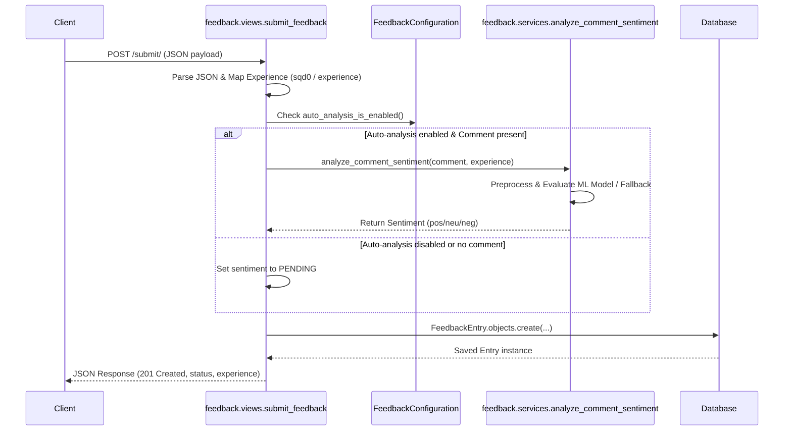
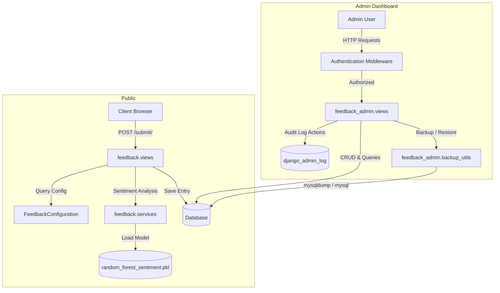

# Project Documentation

## 1. Project Overview
The PhilHealth Feedback System is a Django-based web application designed to collect Client Satisfaction Measurement (CSM) feedback, ratings, and comments for LHIO Cauayan City. It features a public-facing feedback submission interface with automated machine learning sentiment analysis, alongside a secure administrative dashboard (`feedback_admin`) for staff management, response monitoring, auditing, report generation, and MySQL database backup/restore.

---

## 2. Technology Stack
- **Framework**: Django 6.0.6
- **Language**: Python
- **Database Engine**: PostgreSQL (default configured via `DATABASES`), with MySQL client support specifically integrated in backup utilities (`mysqldump` / `mysql`).
- **Machine Learning / NLP**: `joblib`, `nltk` (SnowballStemmer), scikit-learn models (`random_forest_sentiment.pkl`).
- **Frontend / Styling**: Tailwind CSS (via CDN), Google Fonts (IBM Plex Sans, IBM Plex Mono, Material Icons Round).
- **Deployment Utilities**: WhiteNoise middleware for static files.

---

## 3. Project Structure
```text
philhealth_feedback/
├── manage.py
├── philhealth_feedback/        # Project settings and root URLs
│   ├── __init__.py
│   ├── asgi.py
│   ├── settings.py
│   ├── urls.py
│   └── wsgi.py
├── feedback/                   # Public feedback submission and sentiment service
│   ├── admin.py
│   ├── apps.py
│   ├── models.py
│   ├── services.py
│   ├── tests.py
│   ├── urls.py
│   └── views.py
├── feedback_admin/             # Administrative dashboard, audit logging, and backup utilities
│   ├── admin.py
│   ├── apps.py
│   ├── backup_utils.py
│   ├── context_processors.py
│   ├── models.py
│   ├── tests.py
│   └── urls.py
│   └── views.py
└── templates/                  # HTML templates
    └── base.html
```

---

## 4. Application Components
- **`philhealth_feedback`**: Core configuration package handling application routing (`philhealth_feedback/urls.py`), global middleware, templates, and database configuration (`philhealth_feedback/settings.py`).
- **`feedback` app**: Manages public endpoints for loading the feedback index page and handling JSON feedback submissions. It contains the data models (`FeedbackEntry`, `FeedbackConfiguration`) and text preprocessing / sentiment analysis logic (`feedback/services.py`).
- **`feedback_admin` app**: Implements administrative authentication, dashboard analytics, response triage (updating statuses, categories, and internal notes), reporting across multiple time horizons, user/group management, audit logging (`django_admin_log`), and database backup/restore management (`feedback_admin/backup_utils.py`).

---

## 5. Data Model
Based on `feedback/models.py`, two primary models are defined:

### `FeedbackEntry`
Stores individual feedback submissions and metadata.
- **Experience Choices**: `strongly_agree`, `agree`, `neither`, `disagree`, `strongly_disagree`, `na`
- **Sentiment Choices**: `pos` (Positive), `neu` (Neutral), `neg` (Negative), `pending` (Pending)
- **Status Choices**: `pending`, `reviewed`, `resolved`
- **Category Choices**: `complaint`, `suggestion`, `compliment`, `concern`
- **Fields**: `experience`, `sentiment`, `category`, `comment`, `status`, `date_time`, `contact_no`, `email_address`, `age`, `client_type`, `sex`, `name_of_client`, `services_availed` (JSONField), `cc1`, `cc2`, `cc3`, `sqd0` through `sqd8` (Service Quality Dimension ratings), `comments_suggestions`, `commendation`, `created_at`, `updated_at`.
- **Indexes**: Indexed on `status` and `created_at` (ordered descending by `created_at`).

### `FeedbackConfiguration`
A singleton model controlling global configuration options.
- **Fields**: `auto_analysis_enabled` (BooleanField, default `True`), `updated_at`.
- **Implementation**: Overrides `save()` to always enforce `pk = 1`. Includes class methods `get_solo()` and `auto_analysis_is_enabled()`.

---

## 6. API / Routes
URL routing is split between the root configuration (`philhealth_feedback/urls.py`), the `feedback` app (`feedback/urls.py`), and the `feedback_admin` app (`feedback_admin/urls.py`).

### Root & Public Routes (`feedback/urls.py`)
- `GET /`: Index view rendering public feedback form (`views.index`).
- `POST /submit/`: Submits feedback payload as JSON (`views.submit_feedback`).

### Administrative Routes (`feedback_admin/urls.py`, prefixed with `/dashboard/`)
- **Authentication**:
  - `GET/POST /dashboard/login/`: Admin login (`views.admin_login`)
  - `POST /dashboard/logout/`: Admin logout (`views.admin_logout`)
- **Dashboard & Responses**:
  - `GET /dashboard/`: Main dashboard analytics (`views.dashboard`)
  - `GET /dashboard/responses/`: Response listing / management (`views.responses`)
  - `POST /dashboard/responses/<int:entry_id>/status/`: Update response status (`views.response_status_update`)
  - `POST /dashboard/responses/<int:entry_id>/category/`: Update response category (`views.response_category_update`)
  - `POST /dashboard/responses/<int:entry_id>/notes/add/`: Add administrative note (`views.response_note_add`)
  - `GET /dashboard/sentiment_analysis/`: Sentiment analytics overview (`views.sentiment_analysis`)
  - `GET /dashboard/reports/`: Periodic reports (`views.reports`)
  - `GET /dashboard/activity-log/`: Audit trail (`views.activity_log`)
- **User & Group Management**:
  - `GET /dashboard/users/`: Users and groups management page (`views.users`)
  - `POST /dashboard/users/add/`: Create user (`views.user_add`)
  - `POST /dashboard/users/<int:user_id>/edit/`: Edit user (`views.user_edit`)
  - `POST /dashboard/users/<int:user_id>/delete/`: Delete user (`views.user_delete`)
  - `POST /dashboard/users/<int:user_id>/toggle/`: Toggle user active state (`views.user_toggle_active`)
  - `POST /dashboard/settings/password/`: Change current password (`views.change_password`)
  - `POST /dashboard/groups/add/`: Create user group (`views.group_add`)
  - `POST /dashboard/groups/<int:group_id>/edit/`: Edit user group (`views.group_edit`)
  - `POST /dashboard/groups/<int:group_id>/delete/`: Delete user group (`views.group_delete`)
- **Settings & Maintenance**:
  - `GET /dashboard/settings/`: Settings & backup management page (`views.settings_page`)
  - `POST /dashboard/settings/sentiment/`: Update sentiment analysis setting (`views.update_sentiment_settings`)
  - `POST /dashboard/settings/reanalyze/`: Trigger batch sentiment re-analysis (`views.reanalyze_sentiment_view`)
  - `POST /dashboard/settings/backup/create/`: Create SQL backup (`views.backup_create`)
  - `POST /dashboard/settings/backup/restore/`: Restore database from SQL dump (`views.backup_restore`)
  - `GET /dashboard/settings/backup/<str:filename>/download/`: Download SQL backup file (`views.backup_download`)
  - `POST /dashboard/settings/backup/<str:filename>/delete/`: Delete SQL backup file (`views.backup_delete`)

---

## 7. Application Workflow

### Feedback Submission Workflow


---

## 8. Business Logic
- **Experience & SQD Mapping**: Incoming feedback maps Service Quality Dimension ratings (`sqd0`) or direct strings through `SQD_MAP` to standard `FeedbackEntry` experience choices.
- **Sentiment Analysis Pipeline (`feedback/services.py`)**:
  - Loads `random_forest_sentiment.pkl` and `stopwords_en.txt` from the app's `ml/` directory.
  - `_preprocess_light()` strips header prefixes (e.g., `"Comments:"`), lowercases text, filters non-alphabetic tokens, removes stopwords, and stems tokens using `SnowballStemmer`.
  - Evaluates prediction probabilities (threshold `>= 0.28`) or direct model labels, falling back to experience-based heuristics (`_fallback_from_experience`) when the model is unavailable or text is insufficient.
- **Audit Logging**: Administrative actions, status changes, notes, and user modifications record entries into Django's built-in `django_admin_log` table via helper utilities in `feedback_admin/views.py`.

---

## 9. Authentication and Authorization
- Public feedback submission (`/` and `/submit/`) is unauthenticated.
- All dashboard endpoints (`/dashboard/...`) require staff authentication enforced via `@login_required`.
- Backup creation, restoration, and deletion actions explicitly check `request.user.is_superuser`.
- Self-deletion and self-deactivation safeguards are enforced in user management views.

---

## 10. Configuration
Project settings defined in `philhealth_feedback/settings.py`:
- **Database**: Configured via environment variables (`DB_ENGINE`, `DB_NAME`, `DB_USER`, `DB_PASSWORD`, `DB_HOST`, `DB_PORT`, `DB_SSLMODE`).
- **Time Zone**: `Asia/Manila` with internationalization and timezone support enabled (`USE_TZ = True`).
- **Static Files**: Managed via WhiteNoise (`whitenoise.middleware.WhiteNoiseMiddleware`).
- **Login URLs**: `LOGIN_URL = '/dashboard/login/'`, `LOGIN_REDIRECT_URL = '/dashboard/'`, `LOGOUT_REDIRECT_URL = '/dashboard/login/'`.
- **Backup Directory**: Controlled by `BACKUP_DIR` setting (defaulting to `BASE_DIR/backups`).

---

## 11. Database and Data Flow
- **Default Database**: PostgreSQL (configured via `DATABASES['default']`).
- **Backup/Restore Utilities (`feedback_admin/backup_utils.py`)**: Requires MySQL (`django.db.backends.mysql`) to perform subprocess executions of `mysqldump` and `mysql` using temporary, secure `0600`-permission configuration files.

---

## 12. System Architecture


---

## 13. Important Implementation Details
- **Singleton Pattern**: `FeedbackConfiguration` ensures a single configuration row (`pk = 1`) via `get_solo()` and overridden `save()` logic.
- **Context Processor**: `feedback_admin.context_processors.feedback_stats` injects `global_feedback_count` into templates when requests start with `/dashboard/`.
- **Testing**: Comprehensive test suites exist in both `feedback/tests.py` and `feedback_admin/tests.py`, covering submission payloads, auto-analysis toggle persistence, view rendering, and reporting calculations.